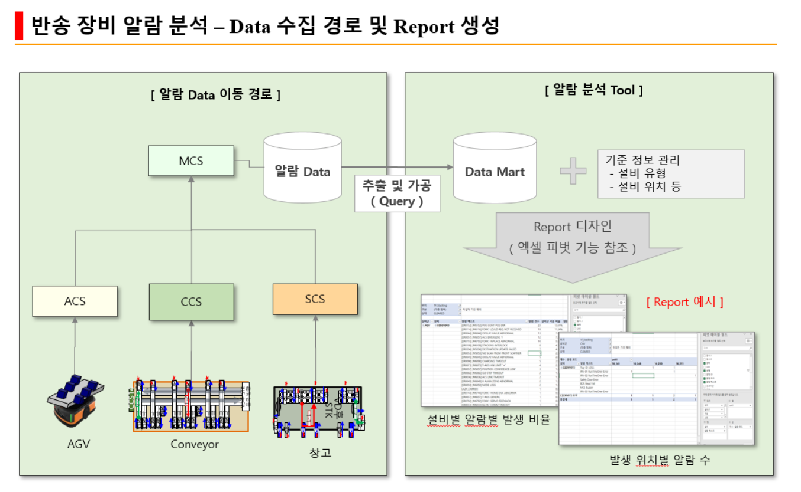

# 알람 분석 애플리케이션 기술서

## 프로젝트 개요
본 애플리케이션은 2차 전지 제조 과정의 물류 시스템에서 발생하여 수집된 알람 데이터를 추출하여 시각화 및 분석하는 도구입니다.

## 목적
- 물류 시스템에서 발생하는 알람 데이터의 체계적 분석
- 알람 패턴 분석을 통한 문제점 조기 발견
- 데이터 기반 의사결정 지원
- 생산 효율성 향상

## 데이터 흐름

1. 원시 데이터 수집 - 물류 시스템에서 생성되는 로그 및 알람 데이터
2. 알람 데이터 추출/가져오기 - 수집된 원시 데이터로부터 알람 정보 추출하여 DataMart(우리 App)으로 가져오기
3. 데이터 시각화 - 가져온 알람 데이터를 다양한 형태로 시각화
4. 데이터 분석 - 시간별, 유형별, 심각도별 다양한 형태 분석

## 주요 기능
1. 대시보드 - 실시간 알람 상태 및 추이 시각화
2. 기준정보관리 - 알람 유형, 코드, 심각도 등 기준정보 관리
3. 데이터 추출 기능 - 원시 데이터로부터 알람 정보를 추출하여 가져오기
4. 알람 분석 - 시간별, 유형별 알람 발생 패턴 분석 및 시각화
5. 리포트 생성 - 피봇형식으로 사용자가 직접 원하는 형태의 리포트 작성 및 저장 기능

## 기술 스택
- 개발 언어 및 프레임워크: Python for Shiny
- 데이터베이스: SQLite
- 시각화 라이브러리: Plotly, Matplotlib
- 데이터 처리: Pandas, NumPy

## 개발 계획
### 1단계: 프로젝트 초기화 및 환경 설정
- Python 가상 환경 설정
- 필요 패키지 설치 및 requirements.txt 작성
- 프로젝트 디렉토리 구조 생성
- config.py 작성
- 기본 README.md 작성

### 2단계: UI 개발
- 전체적인 애플리케이션 구조 설계 및 구현
- 서버 로직 없이 UI 컴포넌트 개발 (서버 부분은 pass로 처리)
- 데이터 흐름을 구체적으로 현실화
- 주요 기능의 배치 및 레이아웃 확정
- 네비게이션 및 사용자 경험 최적화

### 3단계: 데이터베이스 설계 및 초기 데이터 로드
- 데이터베이스 스키마 설계 및 구현
- 테이블 구조 정의:
  * 알람 이벤트 테이블: 알람 ID, 발생 시간, 설비 ID, 알람 코드, 심각도, 상태 등
  * 설비 마스터 테이블: 설비 ID, 설비명, 설비 유형, 위치, 담당자 등
  * 알람 마스터 테이블: 알람 코드, 알람명, 설명, 조치 방법 등
  * 코드 테이블: 코드 유형, 코드 값, 코드 설명 등
- 데이터베이스 인덱스 설계로 쿼리 성능 최적화
- 초기 데이터 로드 및 검증 프로세스 구현
- 데이터 무결성 규칙 및 제약조건 설정
- 테스트 데이터 생성 및 로드
 (*) 테이블 구조는 실제 진행단계에서 변경/확정 예정임

### 4단계: 데이터 추출 및 기준정보 관리 기능 개발
- 텍스트 파일에서 알람 데이터 추출 기능 구현
- 기준정보 관리 기능 구현
- 준비된 텍스트 파일에서 초기 기준정보 로드
- 기준정보 수정, 추가, 삭제 기능 구현
- 기준정보 검증 및 데이터 무결성 확보

### 5단계: 대시보드 및 알람 분석 기능 개발
- 대시보드 모듈 서버 로직 개발
- 시간별, 유형별, 설비별 알람 패턴 분석 알고리즘 구현
- 통계 분석 및 시각화 기능 개발
- 주요 지표 계산 및 동향 분석 로직

### 6단계: 리포트 생성 기능 개발
- 사용자 정의 피봇 형식 리포트 생성 기능
- 다양한 출력 형식 지원 (엑셀, PDF 등)
- 리포트 템플릿 관리 및 사용자화 기능

### 7단계: 테스트 및 최적화
- 종합 테스트 및 오류 수정
- 성능 최적화
- 사용자 피드백 반영 및 개선

## 애플리케이션 구조
- 애플리케이션 패키지명: `alarm_app`
- 주요 모듈:
  * dashboard: 대시보드 모듈
  * master_data: 기준정보관리 모듈
  * data_extraction: 데이터 추출 모듈
  * analysis: 분석 모듈
  * report_generator: 리포트 생성 모듈

## 기대 효과
- 물류 시스템 문제점 조기 발견으로 인한 생산성 향상
- 알람 패턴 분석을 통한 예방적 유지보수 가능
- 데이터 기반 의사결정 지원으로 관리 효율성 증대

> 참고: 본 기술서는 초안이며, 개발 과정에서 지속적으로 업데이트될 예정입니다. 